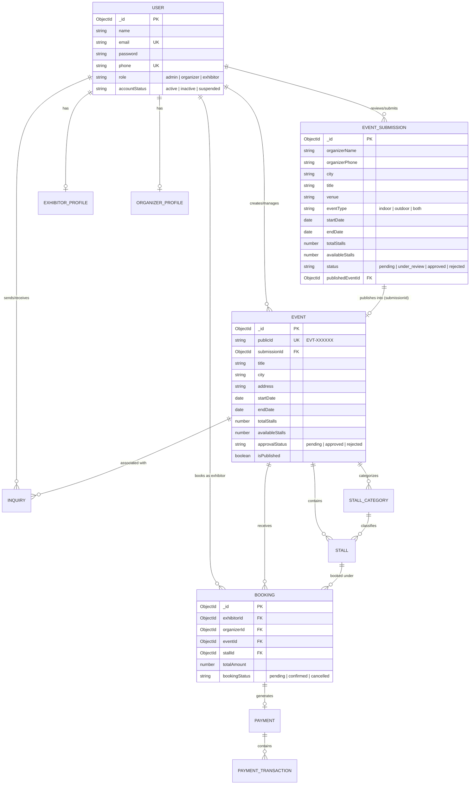
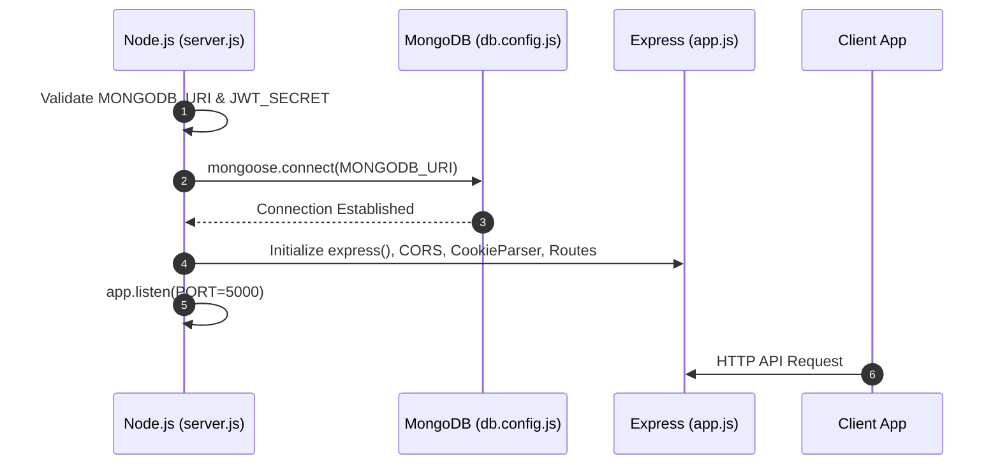
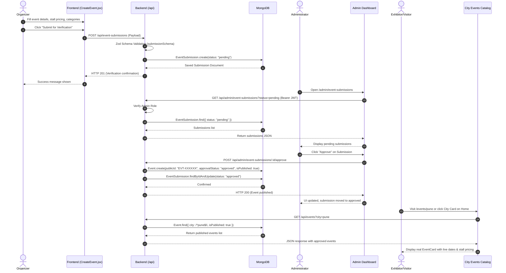

# Enterprise Event Management & Stall Booking Platform

A full-stack, enterprise-grade event management and stall booking platform built with **React 19**, **Vite**, **Tailwind CSS**, **Node.js (Express 5)**, **MongoDB (Mongoose)**, **Zod**, and **JWT Authentication**.

---

## 📋 Table of Contents
1. [System Overview & Architecture](#-system-overview--architecture)
2. [Complete Technology Stack](#-complete-technology-stack)
3. [Project Directory Layout](#-project-directory-layout)
4. [Database Architecture & All Schema Blueprints](#-database-architecture--all-schema-blueprints)
   - [Entity Relationship Diagram (ERD)](#entity-relationship-diagram-erd)
   - [1. User Model](#1-user-model-usermodeljs)
   - [2. Event Submission Model](#2-event-submission-model-eventsubmissionmodeljs)
   - [3. Event Model (Published)](#3-event-model-published-eventmodeljs)
   - [4. Stall Model](#4-stall-model-stallmodeljs)
   - [5. Stall Category Model](#5-stall-category-model-stallcategorymodeljs)
   - [6. Booking Model](#6-booking-model-bookingmodeljs)
   - [7. Payment Model](#7-payment-model-paymentmodeljs)
   - [8. Payment Transaction Model](#8-payment-transaction-model-paymenttransactionmodeljs)
   - [9. Exhibitor Profile Model](#9-exhibitor-profile-model-exhibitorprofilemodeljs)
   - [10. Organizer Profile Model](#10-organizer-profile-model-organizerprofilemodeljs)
   - [11. Inquiry Model](#11-inquiry-model-inquirymodeljs)
5. [Backend Code Flow & API Execution Architecture](#-backend-code-flow--api-execution-architecture)
   - [Server Bootstrap & Lifecycle](#server-bootstrap--lifecycle)
   - [Global Middleware Pipeline](#global-middleware-pipeline)
   - [Authentication & Role-Based Authorization](#authentication--role-based-authorization)
   - [API Endpoints & Controller Deep-Dive](#api-endpoints--controller-deep-dive)
   - [Admin Seeding Pipeline](#admin-seeding-pipeline)
6. [Frontend Code Flow & Component Architecture](#-frontend-code-flow--component-architecture)
   - [Application Bootstrapping & Client Routing](#application-bootstrapping--client-routing)
   - [Centralized Axios API Client](#centralized-axios-api-client)
   - [Page Flows & Component Hierarchy](#page-flows--component-hierarchy)
   - [End-to-End User Journeys & Sequence Diagrams](#end-to-end-user-journeys--sequence-diagrams)
7. [Installation & Setup Guide](#-installation--setup-guide)
8. [Comprehensive Error & Troubleshooting Guide](#-comprehensive-error--troubleshooting-guide)

---

## 🏛️ System Overview & Architecture

The **Enterprise Event Management & Stall Booking Platform** is designed with a decoupled client-server architecture:
- **Client (Frontend)**: Single Page Application (SPA) powered by React 19 and Vite with Tailwind CSS v4, delivering responsive views for visitors, exhibitors, organizers, and platform administrators.
- **Server (Backend)**: RESTful API powered by Node.js and Express 5, implementing strict Zod input validation, JSON Web Token (JWT) stateless authentication, and Role-Based Access Control (RBAC).
- **Database**: MongoDB with Mongoose ODM, maintaining normalized models with cross-collection references and embedded sub-documents for dynamic stall layouts.

```
+---------------------------------------------------------------------------------------+
|                                    CLIENT (Vite + React 19)                           |
|  [Home.jsx]  <--->  [CityEventsPage.jsx]  <--->  [EventDetailsPage.jsx]              |
|        |                                                |                             |
|  [CreateEvent.jsx] (Public Submission)            [Login.jsx]                         |
|                                                         |                             |
|                                             [AdminEventSubmissions.jsx]               |
+-------------------------------------------+-------------------------------------------+
                                            |
                                            | HTTPS / REST (Axios + Bearer Token)
                                            v
+---------------------------------------------------------------------------------------+
|                                 SERVER (Express 5 + Node.js)                          |
|  +---------------------------------------------------------------------------------+  |
|  | Middleware: express.json -> cors -> cookieParser -> auth.middleware             |  |
|  +---------------------------------------------------------------------------------+  |
|  | Routes & Controllers:                                                           |  |
|  |  * /api/auth              -> registerExhibitor, login, currentUser              |  |
|  |  * /api/events            -> listPublishedEvents, getPublishedEvent             |  |
|  |  * /api/event-submissions -> createSubmission (Zod Validation)                  |  |
|  |  * /api/admin             -> listSubmissions, reviewSubmission, approveSubmission |  |
|  +---------------------------------------------------------------------------------+  |
+-------------------------------------------+-------------------------------------------+
                                            |
                                            | Mongoose ODM (BSON queries)
                                            v
+---------------------------------------------------------------------------------------+
|                                   DATABASE (MongoDB)                                  |
|   User | EventSubmission | Event | Stall | StallCategory | Booking | Payment | etc.   |
+---------------------------------------------------------------------------------------+
```

---

## 🛠️ Complete Technology Stack

| Layer | Component | Version / Library | Purpose |
| :--- | :--- | :--- | :--- |
| **Frontend** | Framework | React `^19.2.8` | Component-driven UI rendering |
| | Tooling | Vite `^8.2.0` | Development server & fast HMR bundling |
| | Routing | React Router DOM `^7.18.2` | Client-side declarative routing & deep-linking |
| | Styling | Tailwind CSS `^4.3.3` | Utility-first responsive CSS styling |
| | Networking | Axios `^1.19.0` | HTTP client with automatic Bearer token interceptor |
| | Form Handling | React Hook Form & Zod | Form state management & validation |
| | Notifications | React Hot Toast `^2.6.0` | Non-blocking UI toast alerts |
| **Backend** | Runtime | Node.js (ESM `type: "module"`) | Asynchronous server execution |
| | Framework | Express `^5.2.1` | HTTP routing, request pipelines, and middleware |
| | Database ODM | Mongoose `^9.9.1` | Schema definition, validation, and MongoDB queries |
| | Validation | Zod `^4.4.3` | Runtime schema validation for incoming JSON payloads |
| | Security | `bcryptjs` `^3.0.3` | Salted password hashing (12 rounds) |
| | Auth | `jsonwebtoken` `^9.0.3` | Stateless signed JWT token generation & verification |
| | Cross-Origin | `cors` `^2.8.6` | HTTP CORS policy management |
| **Database** | Engine | MongoDB 6.0+ | Document database storing JSON-like records |

---

## 📁 Project Directory Layout

```
Event Management project/
├── README.md                      # Comprehensive system reference & documentation
├── Server/                        # Backend Express API Service
│   ├── .env.example               # Environment variables blueprint
│   ├── package.json               # Backend dependencies & npm scripts
│   ├── README.md                  # Backend specific documentation
│   └── src/
│       ├── app.js                 # Express application initialization & middleware bindings
│       ├── server.js              # Server entry point, DB connection, and HTTP listener
│       ├── config/
│       │   └── db.config.js       # Mongoose connection bootstrapper
│       ├── constants/             # Enums and application-wide constants
│       ├── controllers/
│       │   ├── auth.controller.js            # User registration & login handlers
│       │   ├── event.controller.js           # Public event querying handlers
│       │   └── eventSubmission.controller.js # Organizer submission & Admin approval handlers
│       ├── middlewares/
│       │   ├── auth.middleware.js # JWT validation & RBAC (allowRoles) middlewares
│       │   └── error.middleware.js# 404 Not Found & centralized error handling
│       ├── models/                # 11 Mongoose Schemas:
│       │   ├── Booking.model.js
│       │   ├── Event.model.js
│       │   ├── EventSubmission.model.js
│       │   ├── ExhibitorProfile.model.js
│       │   ├── Inquiry.model.js
│       │   ├── OrganizerProfile.model.js
│       │   ├── Payment.model.js
│       │   ├── PaymentTransaction.model.js
│       │   ├── Stall.model.js
│       │   ├── StallCategory.model.js
│       │   └── User.model.js
│       ├── routes/
│       │   ├── admin.routes.js           # Protected Admin routes (/api/admin)
│       │   ├── auth.routes.js            # Public Auth routes (/api/auth)
│       │   ├── event.routes.js           # Public Event routes (/api/events)
│       │   └── eventSubmission.routes.js # Public Submission route (/api/event-submissions)
│       ├── scripts/
│       │   └── seedAdmin.js       # Admin user seeding CLI utility
│       └── utils/
│           ├── ApiError.js        # Standardized custom error class
│           └── asyncHandler.js    # Express async/await exception wrapper
│
└── client/                        # Frontend React 19 Application
    ├── .env.example               # Frontend environment template
    ├── package.json               # Frontend dependencies & Vite scripts
    ├── vite.config.js             # Vite configuration with Tailwind CSS plugin
    ├── index.html                 # Main Single Page Application HTML shell
    └── src/
        ├── App.jsx                # Route declarations & top-level layout wrapper
        ├── main.jsx               # React DOM root renderer
        ├── components/
        │   ├── common/
        │   │   ├── Modal.jsx              # Reusable popup modal wrapper
        │   │   └── ScrollToTop.jsx        # Route change scroll reset handler
        │   ├── events/
        │   │   ├── CategoryModal.jsx      # Multi-select category picker modal
        │   │   ├── EventCard.jsx          # Event card for listings & search
        │   │   ├── FacilityModal.jsx      # Multi-select facility picker modal
        │   │   └── StallDetailsManager.jsx# Dynamic stall pricing & table/chair setup
        │   ├── home/
        │   │   ├── CityCard.jsx           # City navigation card
        │   │   ├── CityGridSection.jsx    # Indian city exploration grid
        │   │   ├── HeroBanner.jsx         # Hero section with primary search & CTAs
        │   │   └── StatsSection.jsx       # Platform metrics counter display
        │   └── layout/
        │       ├── Footer.jsx             # Global responsive footer
        │       ├── Navbar.jsx             # Main navigation bar with auth & city dropdown
        │       └── SocialBanner.jsx       # Social engagement strip
        ├── constants/
        │   ├── eventsData.js              # Fallback event dataset
        │   └── homeData.js                # Top cities & category lists
        ├── pages/
        │   ├── Home.jsx                   # Public home page
        │   ├── CreateEvent.jsx            # Multi-step public event creation form
        │   ├── CityEventsPage.jsx         # Filtered events catalog by city
        │   ├── EventDetailsPage.jsx       # Individual event detail & stall view
        │   ├── Login.jsx                  # Exhibitor & Admin login page
        │   └── AdminEventSubmissions.jsx  # Admin submission verification queue
        └── services/
            └── api.js                     # Configured Axios instance with JWT interceptor
```

---

## 🗄️ Database Architecture & All Schema Blueprints

### Entity Relationship Diagram (ERD)



---

### 1. User Model (`User.model.js`)
Stores system credentials, profile details, and role assignments.

```javascript
// Server/src/models/User.model.js
{
  name: { type: String, required: true, trim: true },
  email: { type: String, required: true, unique: true, lowercase: true, trim: true },
  password: { type: String, required: true }, // Bcrypt hashed
  phone: { type: String, required: true, unique: true, trim: true },
  role: { 
    type: String, 
    enum: ["admin", "organizer", "exhibitor"], 
    default: "exhibitor" 
  },
  city: { type: String, default: null, trim: true },
  gender: { 
    type: String, 
    enum: ["male", "female", "other", "prefer_not_to_say"], 
    default: "prefer_not_to_say" 
  },
  isVerified: { type: Boolean, default: false },
  emailVerificationToken: { type: String, default: null },
  emailVerificationExpires: { type: Date, default: null },
  profileImage: { type: String, default: null },
  accountStatus: { 
    type: String, 
    enum: ["active", "inactive", "suspended"], 
    default: "active" 
  },
  createdBy: { type: mongoose.Schema.Types.ObjectId, ref: "User", default: null },
  updatedBy: { type: mongoose.Schema.Types.ObjectId, ref: "User", default: null },
  deletedBy: { type: mongoose.Schema.Types.ObjectId, ref: "User", default: null },
  deletedAt: { type: Date, default: null } // Soft deletion support
}
```

---

### 2. Event Submission Model (`EventSubmission.model.js`)
Captures raw proposals submitted by event organizers awaiting administrative verification.

```javascript
// Server/src/models/EventSubmission.model.js
const stallOptionSchema = new mongoose.Schema({
  stallType: { type: String, required: true, trim: true },
  tables: { type: Number, default: 0, min: 0 },
  chairs: { type: Number, default: 0, min: 0 },
  priceForEvent: { type: Number, required: true, min: 0 },
  pricePerDay: { type: Number, default: null, min: 0 }
}, { _id: false });

const eventSubmissionSchema = new mongoose.Schema({
  organizerName: { type: String, required: true, trim: true },
  organizerPhone: { type: String, required: true, trim: true },
  organizerEmail: { type: String, default: null, trim: true, lowercase: true },
  city: { type: String, required: true, trim: true },
  title: { type: String, required: true, trim: true },
  venue: { type: String, required: true, trim: true },
  venueType: { type: String, default: null, trim: true },
  eventType: { type: String, enum: ["indoor", "outdoor", "both"], required: true },
  startDate: { type: Date, required: true },
  endDate: { type: Date, required: true },
  totalStalls: { type: Number, required: true, min: 1 },
  availableStalls: { type: Number, required: true, min: 0 },
  expectedVisitors: { type: String, default: null, trim: true },
  description: { type: String, default: "", trim: true },
  highlights: { type: String, default: null, trim: true },
  categories: { type: [String], default: [] },
  facilities: { type: [String], default: [] },
  stallSetup: {
    model: { type: String, required: true, trim: true },
    options: { type: [stallOptionSchema], required: true }
  },
  posterImage: { type: String, default: null },
  floorPlanImage: { type: String, default: null },
  status: { 
    type: String, 
    enum: ["pending", "under_review", "approved", "rejected"], 
    default: "pending", 
    index: true 
  },
  adminNotes: { type: String, default: null, trim: true },
  reviewedBy: { type: mongoose.Schema.Types.ObjectId, ref: "User", default: null },
  reviewedAt: { type: Date, default: null },
  publishedEventId: { type: mongoose.Schema.Types.ObjectId, ref: "Event", default: null }
}, { timestamps: true });

// Compound Index for efficient administrative querying
eventSubmissionSchema.index({ city: 1, status: 1, startDate: 1 });
```

---

### 3. Event Model (Published) (`Event.model.js`)
Represents verified, published exhibitions and events publicly discoverable and bookable.

```javascript
// Server/src/models/Event.model.js
{
  publicId: { type: String, required: true, unique: true, index: true }, // Format: EVT-XXXXXX
  organizerId: { type: mongoose.Schema.Types.ObjectId, ref: "User", default: null },
  submissionId: { type: mongoose.Schema.Types.ObjectId, ref: "EventSubmission", required: true, unique: true },
  organizerName: { type: String, required: true, trim: true },
  organizerPhone: { type: String, required: true, trim: true },
  title: { type: String, required: true, trim: true },
  description: { type: String, required: true, trim: true },
  eventType: { type: String, required: true, enum: ["indoor", "outdoor", "both"], lowercase: true },
  categories: { type: [String], default: [] },
  city: { type: String, required: true, trim: true },
  address: { type: String, required: true, trim: true },
  startDate: { type: Date, required: true },
  endDate: { type: Date, required: true },
  approvalStatus: { type: String, enum: ["pending", "approved", "rejected"], default: "pending" },
  posterImage: { type: String, default: null },
  floorPlanImage: { type: String, default: null },
  facilities: { type: [String], default: [] },
  stallSetup: {
    model: { type: String, required: true, trim: true },
    options: [stallOptionSchema]
  },
  totalStalls: { type: Number, required: true, min: 0 },
  availableStalls: { type: Number, required: true, min: 0 },
  venueType: { type: String, default: null },
  expectedVisitors: { type: String, default: null },
  highlights: { type: String, default: null },
  isPublished: { type: Boolean, default: true },
  createdBy: { type: mongoose.Schema.Types.ObjectId, ref: "User", default: null },
  updatedBy: { type: mongoose.Schema.Types.ObjectId, ref: "User", default: null },
  deletedBy: { type: mongoose.Schema.Types.ObjectId, ref: "User", default: null },
  deletedAt: { type: Date, default: null }
}
```

---

### 4. Stall Model (`Stall.model.js`)
Tracks individual physical/virtual stalls on the event floor plan.

```javascript
// Server/src/models/Stall.model.js
{
  eventId: { type: mongoose.Schema.Types.ObjectId, ref: "Event", required: true },
  stallCategoryId: { type: mongoose.Schema.Types.ObjectId, ref: "StallCategory", required: true },
  stallNumber: { type: String, required: true, trim: true },
  status: { 
    type: String, 
    enum: ["available", "reserved", "booked"], 
    default: "available" 
  },
  positionX: { type: Number, default: null },
  positionY: { type: Number, default: null },
  createdBy: { type: mongoose.Schema.Types.ObjectId, ref: "User", default: null },
  updatedBy: { type: mongoose.Schema.Types.ObjectId, ref: "User", default: null },
  deletedBy: { type: mongoose.Schema.Types.ObjectId, ref: "User", default: null },
  deletedAt: { type: Date, default: null }
}
```

---

### 5. Stall Category Model (`StallCategory.model.js`)
Defines tier configurations, dimensions, and daily pricing per stall type.

```javascript
// Server/src/models/StallCategory.model.js
{
  eventId: { type: mongoose.Schema.Types.ObjectId, ref: "Event", required: true },
  name: { type: String, required: true, enum: ["Premium", "Gold", "Silver"], trim: true },
  pricePerDay: { type: Number, required: true },
  size: { type: String, trim: true, default: null },
  facilities: { type: [String], default: [] },
  description: { type: String, trim: true, default: null },
  createdBy: { type: mongoose.Schema.Types.ObjectId, ref: "User", default: null },
  updatedBy: { type: mongoose.Schema.Types.ObjectId, ref: "User", default: null },
  deletedBy: { type: mongoose.Schema.Types.ObjectId, ref: "User", default: null },
  deletedAt: { type: Date, default: null }
}
```

---

### 6. Booking Model (`Booking.model.js`)
Records stall reservations placed by exhibitors.

```javascript
// Server/src/models/Booking.model.js
{
  exhibitorId: { type: mongoose.Schema.Types.ObjectId, ref: "User", required: true },
  organizerId: { type: mongoose.Schema.Types.ObjectId, ref: "User", required: true },
  eventId: { type: mongoose.Schema.Types.ObjectId, ref: "Event", required: true },
  stallId: { type: mongoose.Schema.Types.ObjectId, ref: "Stall", required: true },
  bookingDate: { type: Date, default: Date.now },
  totalAmount: { type: Number, required: true },
  bookingStatus: { 
    type: String, 
    enum: ["pending", "confirmed", "cancelled"], 
    default: "pending" 
  },
  createdBy: { type: mongoose.Schema.Types.ObjectId, ref: "User", default: null },
  updatedBy: { type: mongoose.Schema.Types.ObjectId, ref: "User", default: null },
  deletedBy: { type: mongoose.Schema.Types.ObjectId, ref: "User", default: null },
  deletedAt: { type: Date, default: null }
}
```

---

### 7. Payment Model (`Payment.model.js`)
Aggregates the financial state of a booking.

```javascript
// Server/src/models/Payment.model.js
{
  bookingId: { type: mongoose.Schema.Types.ObjectId, ref: "Booking", required: true, unique: true },
  totalAmount: { type: Number, required: true },
  amountPaid: { type: Number, default: 0 },
  paymentStatus: { 
    type: String, 
    enum: ["pending", "partial", "paid", "refunded"], 
    default: "pending" 
  },
  createdBy: { type: mongoose.Schema.Types.ObjectId, ref: "User", default: null },
  updatedBy: { type: mongoose.Schema.Types.ObjectId, ref: "User", default: null },
  deletedBy: { type: mongoose.Schema.Types.ObjectId, ref: "User", default: null },
  deletedAt: { type: Date, default: null }
}
```

---

### 8. Payment Transaction Model (`PaymentTransaction.model.js`)
Logs discrete payment gateway transactions, transaction IDs, and responses.

```javascript
// Server/src/models/PaymentTransaction.model.js
{
  paymentId: { type: mongoose.Schema.Types.ObjectId, ref: "Payment", required: true },
  transactionId: { type: String, required: true, unique: true, trim: true },
  transactionType: { type: String, required: true, enum: ["payment", "refund"] },
  paymentMethod: { type: String, required: true, trim: true },
  amount: { type: Number, required: true },
  transactionStatus: { type: String, required: true, enum: ["pending", "success", "failed"] },
  gatewayResponse: { type: mongoose.Schema.Types.Mixed, default: null },
  processedAt: { type: Date, default: Date.now },
  createdBy: { type: mongoose.Schema.Types.ObjectId, ref: "User", default: null },
  updatedBy: { type: mongoose.Schema.Types.ObjectId, ref: "User", default: null },
  deletedBy: { type: mongoose.Schema.Types.ObjectId, ref: "User", default: null },
  deletedAt: { type: Date, default: null }
}
```

---

### 9. Exhibitor Profile Model (`ExhibitorProfile.model.js`)
Stores company information and business metadata for exhibitor accounts.

```javascript
// Server/src/models/ExhibitorProfile.model.js
{
  userId: { type: mongoose.Schema.Types.ObjectId, ref: "User", required: true, unique: true },
  companyName: { type: String, required: true, trim: true },
  productCategory: { type: String, required: true, trim: true },
  businessType: { type: String, required: true, trim: true },
  createdBy: { type: mongoose.Schema.Types.ObjectId, ref: "User", default: null },
  updatedBy: { type: mongoose.Schema.Types.ObjectId, ref: "User", default: null },
  deletedBy: { type: mongoose.Schema.Types.ObjectId, ref: "User", default: null },
  deletedAt: { type: Date, default: null }
}
```

---

### 10. Organizer Profile Model (`OrganizerProfile.model.js`)
Stores organization verification data, GST numbers, and business addresses.

```javascript
// Server/src/models/OrganizerProfile.model.js
{
  userId: { type: mongoose.Schema.Types.ObjectId, ref: "User", required: true, unique: true },
  companyName: { type: String, required: true, trim: true },
  GSTNumber: { type: String, trim: true, default: null },
  businessAddress: { type: String, required: true, trim: true },
  website: { type: String, trim: true, default: null },
  createdBy: { type: mongoose.Schema.Types.ObjectId, ref: "User", default: null },
  updatedBy: { type: mongoose.Schema.Types.ObjectId, ref: "User", default: null },
  deletedBy: { type: mongoose.Schema.Types.ObjectId, ref: "User", default: null },
  deletedAt: { type: Date, default: null }
}
```

---

### 11. Inquiry Model (`Inquiry.model.js`)
Facilitates direct messaging and stall inquiries between exhibitors and event organizers.

```javascript
// Server/src/models/Inquiry.model.js
{
  eventId: { type: mongoose.Schema.Types.ObjectId, ref: "Event", required: true },
  organizerId: { type: mongoose.Schema.Types.ObjectId, ref: "User", required: true },
  exhibitorId: { type: mongoose.Schema.Types.ObjectId, ref: "User", required: true },
  message: { type: String, required: true, trim: true, maxlength: 2000 },
  createdBy: { type: mongoose.Schema.Types.ObjectId, ref: "User", default: null },
  updatedBy: { type: mongoose.Schema.Types.ObjectId, ref: "User", default: null },
  deletedBy: { type: mongoose.Schema.Types.ObjectId, ref: "User", default: null },
  deletedAt: { type: Date, default: null }
}
```

---

## ⚙️ Backend Code Flow & API Execution Architecture

### Server Bootstrap & Lifecycle
The backend initialization flow is executed in `Server/src/server.js`:
1. `dotenv.config()` loads environment keys.
2. Checks that `MONGODB_URI` and `JWT_SECRET` exist; otherwise throws immediate startup error.
3. Invokes `await connectDB()` (`Server/src/config/db.config.js`), establishing the Mongoose connection pool.
4. Starts Express server listener on `PORT` (defaults to 5000).



---

### Global Middleware Pipeline

In `Server/src/app.js`, incoming HTTP requests pass through the following ordered pipeline:

```
Incoming HTTP Request
       │
       ▼
 1. express.json()             ──> Parses incoming JSON request body
       │
       ▼
 2. cors()                     ──> Configured with origin: true, credentials: true
       │
       ▼
 3. cookieParser()             ──> Extracts cookies from headers
       │
       ▼
 4. Route Matching             ──> Routes: /api/auth, /api/events, /api/event-submissions, /api/admin
       │
       ▼
 5. notFound Middleware        ──> Handles 404 (Route not found: METHOD /path)
       │
       ▼
 6. Zod & Centralized Error    ──> Transforms ZodError to 400 Bad Request with field errors, or 500
```

---

### Authentication & Role-Based Authorization

Defined in `Server/src/middlewares/auth.middleware.js`:
- `requireAuth`: Extracts `Authorization: Bearer <token>`, validates signature against `process.env.JWT_SECRET`, decodes `userId`, finds active user in MongoDB (`accountStatus: "active"`, `deletedAt: null`), and binds user record to `req.user`.
- `allowRoles(...roles)`: Verifies if `roles.includes(req.user.role)`. If unauthorized, throws `ApiError(403, "You do not have permission for this action")`.

```javascript
// JWT Generation in auth.controller.js
const tokenFor = (user) =>
  jwt.sign({ userId: user._id, role: user.role }, process.env.JWT_SECRET, {
    expiresIn: "7d",
  });
```

---

### API Endpoints & Controller Deep-Dive

#### 1. Authentication Routes (`/api/auth`)
| Method | Route | Auth Required | Description |
| :--- | :--- | :--- | :--- |
| `POST` | `/api/auth/register` | None | Validates payload with `exhibitorRegistrationSchema` (supports `name`, `email`, `password`, `phone` (10-20 chars), optional `city` and `gender`), checks for existing email/phone, hashes password using `bcrypt.hash(password, 12)`, and creates user with `role: "exhibitor"`. Returns JWT token & user object. |
| `POST` | `/api/auth/login` | None | Validates credentials via `loginSchema`, compares password hash via `bcrypt.compare`, validates active status, and returns JWT token & user details. |
| `GET` | `/api/auth/me` | Logged In (`requireAuth`) | Returns currently authenticated user profile (`req.user`) stripped of sensitive password hash. |

#### 2. Public Event Routes (`/api/events`)
| Method | Route | Auth Required | Description |
| :--- | :--- | :--- | :--- |
| `GET` | `/api/events` | None | Returns verified events (`approvalStatus: "approved"`, `isPublished: true`, `deletedAt: null`). Supports city regex query `?city=hyderabad`. Sorted by `startDate: 1`. Used for home city aggregations and catalog views. |
| `GET` | `/api/events/:publicId` | None | Retrieves a single verified event by `publicId` (e.g. `EVT-4F2A19`) or valid MongoDB `_id` via `$or` query. |

#### 3. Event Submission Routes (`/api/event-submissions`)
| Method | Route | Auth Required | Description |
| :--- | :--- | :--- | :--- |
| `POST` | `/api/event-submissions` | None | Validates event proposal payload using Zod `submissionSchema` (verifies `startDate >= today`, `endDate >= startDate`, `availableStalls <= totalStalls`, 10-digit phone). Creates document with `status: "pending"`. |

#### 4. Admin Management Routes (`/api/admin`)
*(Protected by `requireAuth` + `allowRoles("admin")`)*
| Method | Route | Auth Required | Description |
| :--- | :--- | :--- | :--- |
| `GET` | `/api/admin/event-submissions` | Admin Only | Retrieves list of submissions filtered by `?status=pending|under_review|approved|rejected|all`. |
| `PATCH` | `/api/admin/event-submissions/:submissionId` | Admin Only | Updates submission state to `under_review` or `rejected` with optional `adminNotes`, setting `reviewedBy` and `reviewedAt`. |
| `POST` | `/api/admin/event-submissions/:submissionId/approve` | Admin Only | Approves submission, generates unique public ID (`EVT-` + last 6 chars of submission ID in uppercase), creates published document in `Event` collection, and marks submission as `approved`. |

---

### Admin Seeding Pipeline

To create an initial platform administrator, run:
```bash
node src/scripts/seedAdmin.js
# or
npm run seed:admin
```
The script reads `ADMIN_NAME`, `ADMIN_EMAIL`, and `ADMIN_PASSWORD` from `.env`, hashes the password, and either creates a new user with `role: "admin"` or updates an existing matching email to `role: "admin"`.

---

## 💻 Frontend Code Flow & Component Architecture

### Application Bootstrapping & Client Routing

The application starts in `client/src/main.jsx`, which renders `App.jsx` wrapped in `BrowserRouter`:

```jsx
// client/src/App.jsx Route Registry
<Router>
  <ScrollToTop />
  <Routes>
    <Route path="/" element={<Home />} />
    <Route path="/create-event" element={<CreateEvent />} />
    <Route path="/events/:cityName" element={<CityEventsPage />} />
    <Route path="/events/details/:eventId" element={<EventDetailsPage />} />
    <Route path="/login" element={<Login />} />
    <Route path="/admin/event-submissions" element={<AdminEventSubmissions />} />
  </Routes>
</Router>
```

---

### Centralized Axios API Client

Located at `client/src/services/api.js`:
- Base URL configured from `import.meta.env.VITE_API_URL || "http://localhost:5000/api"`.
- Intercepts all outgoing requests: if `localStorage.getItem("accessToken")` exists, injects `Authorization: Bearer <token>`.

```javascript
// client/src/services/api.js
import axios from "axios";

const api = axios.create({
  baseURL: import.meta.env.VITE_API_URL || "http://localhost:5000/api",
  headers: { "Content-Type": "application/json" },
});

api.interceptors.request.use((config) => {
  const token = localStorage.getItem("accessToken");
  if (token) config.headers.Authorization = `Bearer ${token}`;
  return config;
});

export default api;
```

---

### Page Flows & Component Hierarchy

#### 1. Home View (`Home.jsx`)
- **Hierarchy**:
  ```
  Home.jsx
  ├── Navbar.jsx (Logo, dynamic city dropdown links, login/dashboard links)
  ├── HeroBanner.jsx (Hero headline, promoted carousel, CTA buttons)
  ├── CityGridSection.jsx (Live database event aggregation per city)
  │   └── CityCard.jsx (Dynamic count badge & navigation to /events/:cityName)
  ├── StatsSection.jsx (Total events, verified stalls, organizer count)
  ├── SocialBanner.jsx (Community links)
  └── Footer.jsx (Copyright, sitemap, quick links)
  ```
- **Live City Grid Aggregation (`CityGridSection.jsx`)**:
  - Automatically fetches all verified events from `GET /api/events`.
  - Calculates real-time event counts per city (`counts[city.toLowerCase()] = count + 1`).
  - Passes dynamic event numbers to each `CityCard` instead of hardcoded numbers.

#### 2. Event Creation View (`CreateEvent.jsx`)
- Multi-step interactive organizer form with state persistence:
  - **Form State**: Organizer contact (`organiserName`, `mobileNumber`, `email`), event metadata (`eventName`, `city`, `eventVenue`, `venueType`, `eventType`), date picker (`startingDate`, `endingDate`), stall inventory (`totalStalls`, `availableStalls`).
  - **Dynamic Stall Setup (`StallDetailsManager.jsx`)**: Organizers can add up to 5 custom stall variations specifying stall type name, included tables/chairs, full-event price, and optional per-day price.
  - **Modals**: `CategoryModal.jsx` (select tags like Jewelry, Apparels, Handicrafts) & `FacilityModal.jsx` (select tags like Power Backup, CCTV, AC, Dustbins).
  - **Submission**: Posts complete object to `api.post("/event-submissions", payload)`. Displays confirmation upon receiving HTTP 201.

#### 3. Dynamic City Catalog View (`CityEventsPage.jsx`)
- Reads `:cityName` URL parameter via `useParams()`.
- Fetches verified events for that city using `api.get('/events?city=' + encodeURIComponent(cityName))`.
- Displays dynamic header banner with breadcrumbs and live counter: `Showing X Verified Event(s) in [CityName]`.
- Implements real-time client-side search filtering over event titles and venue addresses.
- Includes loading spinners and friendly empty state with CTA to "+ Host an Event in [CityName]".
- Renders results using normalized `EventCard.jsx` components.

#### 4. Event Card Component (`EventCard.jsx`)
- Normalizes both database `Event` model (`publicId`, `startDate`, `endDate`, `address`, `stallSetup.options`, `posterImage`) and legacy fallback formats.
- Formats ISO date strings to Indian localized format (e.g. `29th Aug 2026`).
- Unpacks dynamic stall setups into pricing cards with table and chair inclusions.
- Renders direct organizer call button (`tel:${organizerPhone}`) and links to `/events/details/${eventId}`.

#### 5. Dynamic Event Details View (`EventDetailsPage.jsx`)
- Reads `:eventId` (`publicId` or MongoDB `_id`) from route URL.
- Fetches real single event record via `api.get('/events/' + eventId)` with loading spinner and 404 fallback.
- Renders full formatted date range, complete stall pricing matrix, facilities with custom icons, categories, venue address, and description.
- Interactive **Contact Event Organizer** popup modal revealing direct phone number and WhatsApp connectivity.

#### 6. Authentication View (`Login.jsx`)
- Authenticates exhibitors & admins.
- Posts `{ email, password }` to `/api/auth/login`.
- On success, writes `data.token` to `localStorage.setItem("accessToken", data.token)` and user data to `localStorage.setItem("currentUser", JSON.stringify(data.user))`.
- Automatically routes admins to `/admin/event-submissions`.

#### 7. Admin Verification Queue (`AdminEventSubmissions.jsx`)
- Checks for admin authorization token (`Bearer <token>`).
- Tabbed filters: `Pending`, `Under Review`, `Approved`, `Rejected`, `All`.
- Displays cards with organizer contact info, dates, stall numbers, and pricing models.
- Actions:
  - **Approve**: Calls `api.post('/admin/event-submissions/' + id + '/approve')` with optional admin note. Automatically creates live `Event` record (`EVT-XXXXXX`).
  - **Reject**: Calls `api.patch('/admin/event-submissions/' + id)` with mandatory rejection reason.

---

### End-to-End User Journeys & Sequence Diagrams

#### Organizer Submission $\rightarrow$ Admin Approval $\rightarrow$ Dynamic City Discovery Journey:



---

## 🚀 Installation & Setup Guide

### 1. Backend Setup
```bash
# Navigate to backend directory
cd Server

# Install dependencies
npm install

# Create environment configuration file
cp .env.example .env
```

Configure your `.env` file in `Server/`:
```env
PORT=5000
MONGODB_URI=mongodb+srv://<username>:<password>@cluster.mongodb.net/event_management?retryWrites=true&w=majority
JWT_SECRET=your_super_secret_jwt_key_at_least_32_chars_long

# For Admin Seeding:
ADMIN_NAME=Platform Admin
ADMIN_EMAIL=admin@example.com
ADMIN_PASSWORD=AdminSecurePassword123!
```

Seed the platform administrator account:
```bash
npm run seed:admin
```

Start the backend development server:
```bash
npm run dev
# Server will listen on http://localhost:5000
```

---

### 2. Frontend Setup
In a new terminal:
```bash
# Navigate to client directory
cd client

# Install dependencies
npm install

# Create frontend environment configuration file
cp .env.example .env
```

Configure your `.env` in `client/`:
```env
VITE_API_URL=http://localhost:5000/api
```

Start the Vite development server:
```bash
npm run dev
# Frontend will be live at http://localhost:5173
```

---

## ⚠️ Comprehensive Error & Troubleshooting Guide

This section diagnoses common runtime failure modes across the entire stack, detailing exact root causes and tested solutions.

---

### 1. MongoDB Connection Timeout / `MongooseServerSelectionError`
- **Symptom**: Server crashes on startup or hangs with error: `MongooseServerSelectionError: Could not connect to any servers in your MongoDB Atlas cluster`.
- **Root Cause**:
  1. IP address is not whitelisted in MongoDB Atlas Security settings.
  2. Database username or password contains special characters (e.g. `@`, `:`, `/`) that are not URL-encoded.
  3. Local `mongod` service is inactive.
- **Fix**:
  1. Go to MongoDB Atlas $\rightarrow$ **Security** $\rightarrow$ **Network Access** $\rightarrow$ Click **Add IP Address** $\rightarrow$ Add `0.0.0.0/0` (for development) or your current IP.
  2. URL-encode special characters in password (e.g. `@` becomes `%40`).
  3. If running locally, verify `mongod` is active via `Get-Service MongoDB` or running `mongod` in terminal.

---

### 2. Startup Fatal Error (`MONGODB_URI and JWT_SECRET must be set in .env`)
- **Symptom**: Server immediately terminates with: `Error: MONGODB_URI and JWT_SECRET must be set in .env`.
- **Root Cause**: The `.env` file does not exist in `Server/` root directory, or one of the variable names has a typo.
- **Fix**:
  1. Ensure the file is named `.env` (not `.env.txt` or `.env.example`).
  2. Confirm both `MONGODB_URI` and `JWT_SECRET` keys are defined with non-empty values.

---

### 3. Zod Form Submission Validation Failure (`400 Invalid request data`)
- **Symptom**: Submitting `/create-event` returns HTTP 400 with an array of issues like:
  ```json
  {
    "message": "Invalid request data",
    "errors": [
      { "path": ["startDate"], "message": "Start date cannot be in the past" },
      { "path": ["availableStalls"], "message": "Available stalls cannot exceed total stalls" }
    ]
  }
  ```
- **Root Cause**: Payload violates business rules defined in `submissionSchema` (`Server/src/controllers/eventSubmission.controller.js`):
  - `startDate` is earlier than today's date at midnight.
  - `endDate` is earlier than `startDate`.
  - `availableStalls` is greater than `totalStalls`.
  - `organizerPhone` length is not exactly 10 digits.
- **Fix**:
  - Ensure dates are today or in the future, `endDate >= startDate`, `availableStalls <= totalStalls`, and phone number consists of 10 digits.

---

### 4. Admin Access Denied (`403 Forbidden` / "You do not have permission for this action")
- **Symptom**: Admin dashboard displays error message banner when attempting to fetch or approve submissions.
- **Root Cause**: The authenticated user's JWT token contains `role: "exhibitor"` or `"organizer"` instead of `"admin"`.
- **Fix**:
  1. In `Server/`, execute `npm run seed:admin` with valid credentials in `.env`.
  2. In frontend, click **Log out** to remove the old token from `localStorage`.
  3. Log in again with the administrative credentials.

---

### 5. CORS Blocked or `AxiosError: Network Error`
- **Symptom**: Browser console displays: `Access to XMLHttpRequest has been blocked by CORS policy: No 'Access-Control-Allow-Origin' header is present`.
- **Root Cause**:
  1. Backend server is offline or crashed.
  2. Frontend `VITE_API_URL` in `client/.env` points to the wrong port or URL.
- **Fix**:
  1. Verify backend is active by checking `http://localhost:5000/api/health` in browser.
  2. Verify `client/.env` contains `VITE_API_URL=http://localhost:5000/api`.
  3. Restart Vite dev server after modifying `.env` (`Ctrl + C` $\rightarrow$ `npm run dev`).

---

### 6. Session Invalid / Expired (`401 Unauthorized`)
- **Symptom**: API calls to protected routes return `401 Unauthorized` ("Your session is invalid or has expired").
- **Root Cause**:
  1. The 7-day token expiration window has elapsed.
  2. `JWT_SECRET` in `Server/.env` was modified, invalidating previously issued tokens.
- **Fix**:
  - Clear invalid token via `localStorage.removeItem("accessToken")` or click the **Log out** button in the navbar, then re-authenticate at `/login`.

---

### 7. Duplicate Approval Error (`409 Conflict` / "This submission has already been approved")
- **Symptom**: Clicking "Approve" on a submission produces a 409 conflict error.
- **Root Cause**: The submission document in MongoDB already has `status: "approved"`, preventing duplicate `Event` creation.
- **Fix**:
  - Switch the status filter in the Admin dashboard dropdown to **"Pending"** to view only unapproved submissions.

---

## 📄 License

Distributed under the **ISC License**. Developed for modern, scalable event management, space allocation, and exhibition stall bookings.
